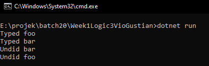
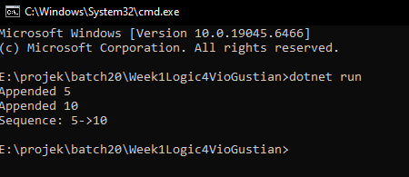
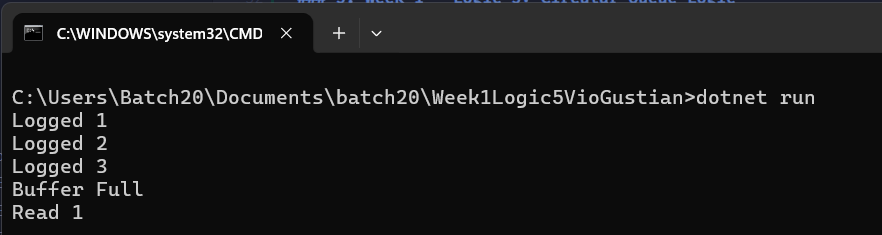
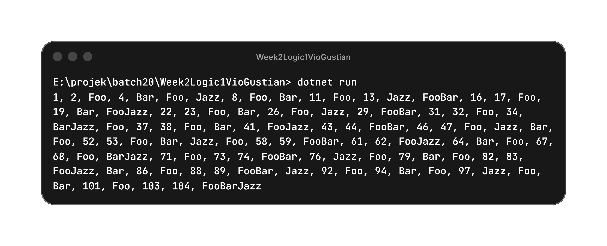
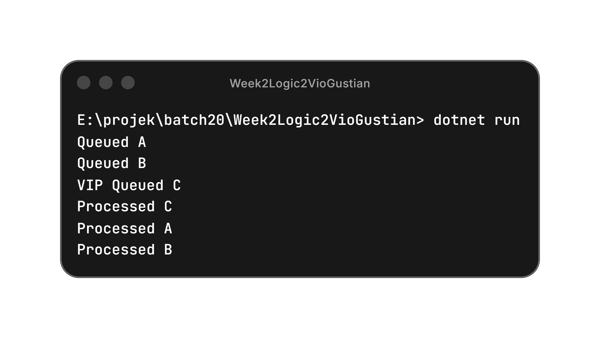
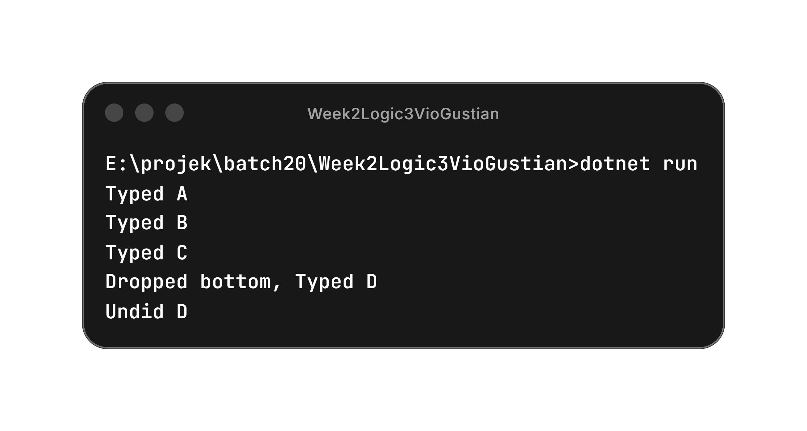
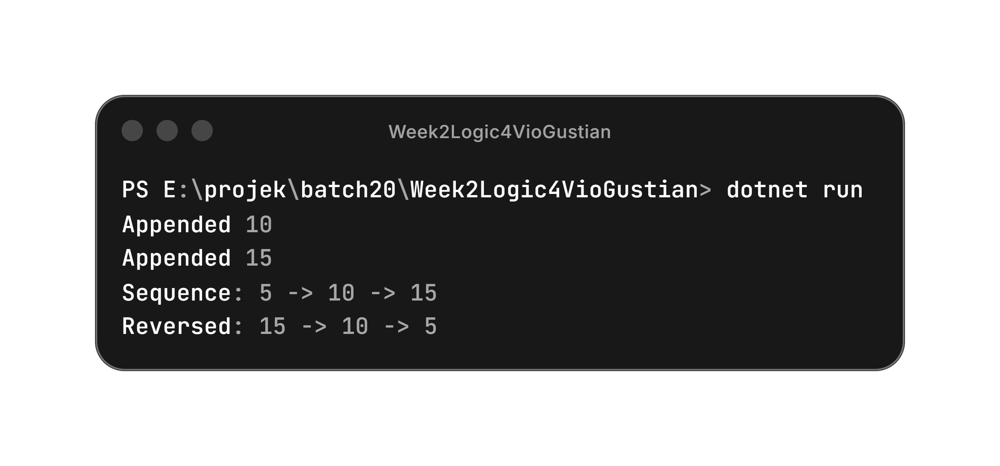
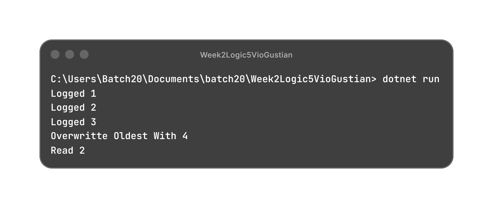

# Formulatrix SE Backend Bootcamp - Batch 20 

Welcome to my repository! This repository contains a collection of assignments and project submissions for the Software Engineer Backend Bootcamp - Batch 20 program at Formulatrix. All tasks are developed using C# (.NET).

---

## 📁 Task List

### 1. Week 1 - Logic 1: FooBarr

**Description:**  
A console application that generates a sequence of outputs based on the following rules:
- Multiples of `3` print **"Foo"**.
- Multiples of `5` print **"Bar"**.
- Multiples of both `3` and `5` print **"FooBar"**.

**Output:**  

### 2. Week 1 - Logic 2: Queue Logic

**Description:**  
A console application implementing a First-In-First-Out (FIFO) queue system that processes operations using direct method calls. The program is built with Separation of Concerns (SoC) and handles the following specific requirements:
- `Enqueue(val)`: Adds `[val]` to the back of the queue and outputs **"Queued [val]"**.
- `Process()`: Removes the front value of the queue and outputs **"Processed [val]"**.
- **Edge Case Handling**: Outputs **"Queue is empty"** if `Process()` is called but there is no value left in the queue.

**Output:**  

### 3. Week 1 - Logic 3: Stack Logic

**Description:**  
A console application implementing a Last-In-First-Out (LIFO) stack system that processes operations using direct method calls. The program is built with Separation of Concerns (SoC) and handles the following specific requirements:
- `Type(word)`: Pushes `[word]` to the top of the stack and outputs **"Typed [word]"**.
- `Undo()`: Removes the top value of the stack and outputs **"Undid [word]"**.
- **Edge Case Handling**: Outputs **"Nothing to undo."** if `Undo()` is called but there is no value left in the stack.

**Output:**  

### 4. Week 1 - Logic 4: Sequence Logic

**Description:** 
A console application that manages a sequence of integers using a custom Node structure (Head & Tail Linked List). The program processes operations using direct method calls and handles the following specific requirements:
- `Append(val)`: Adds a new node containing `[val]` to the tail of the sequence and outputs **"Appended [val]"**.
- `Print()`: Traverses the connected nodes from head to tail and outputs the sequence in the format **"Sequence: [val1] -> [val2]"**.

**Output:** 

### 5. Week 1 - Logic 5: Circular Queue Logic

**Description:**  
A console application implementing a fixed-size Circular Queue (ring buffer) that processes operations using direct method calls. The program is built with Separation of Concerns (SoC) and handles the following specific requirements:
- `Log(val)`: Adds `[val]` to the buffer and outputs **"Logged [val]"**. If the buffer has reached its maximum capacity, outputs **"Buffer Full"** and rejects the value instead.
- `Read()`: Removes and outputs the oldest unread value in the format **"Read [val]"**.
- **Edge Case Handling**: Outputs **"Log is Empty."** if `Read()` is called but there is no value left in the buffer.

**Output:**  

### 6. Week 2 - Logic 1: FooBarJazz

**Description:**  
A console application that extends the Week 1 FooBar logic with a third rule based on divisibility by `7`. Unlike the original if-else-if approach, matching rules now concatenate instead of being mutually exclusive:
- Multiples of `3` print **"foo"**.
- Multiples of `5` print **"bar"**.
- Multiples of `7` print **"jazz"**.
- Numbers matching multiple rules print the combined output (e.g. `21` → **"foojazz"**, `35` → **"barjazz"**, `105` → **"foobarjazz"**).

**Output:**  

### 7. Week 2 - Logic 2: Queue VIP Logic

**Description:**  
A console application implementing a First-In-First-Out (FIFO) queue system that includes a priority line. The program is built with Separation of Concerns (SoC) and handles the following specific requirements:
- `Enqueue(val)`: Adds `[val]` to the back of the queue and outputs **"Queued [val]"**.
- `EnqueueVip(val)`: Adds `[val]` to the absolute front of the queue instead of the back and outputs **"VIP Queued [val]"**.
- `Process()`: Removes the front value of the queue and outputs **"Processed [val]"**.
- **Edge Case Handling**: Outputs **"Queue is empty"** if `Process()` is called but there is no value left in the queue.

**Output:**  

### 8. Week 2 - Logic 3: Stack Logic Limit

**Description:**
A console application that extends the Week 1 Stack Logic with a maximum history limit of `3` items. The program maintains a Last-In-First-Out (LIFO) stack system using direct method calls and handles the following specific requirements:

* `Type(word)`: Pushes `[word]` to the top of the stack and outputs **"Typed [word]"**.
* **Maximum History Limit**: The stack can set a maximum items.
* **History Overflow**: If `Type(word)` is called when the stack already contains maximum items limit, the oldest item at the absolute bottom of the stack is removed to make room for the new item. The program outputs **"Dropped bottom, Typed [word]"**.
* `Undo()`: Removes the top value of the stack and outputs **"Undid [word]"**.
* **Edge Case Handling**: Outputs **"Nothing to undo."** if `Undo()` is called but there is no value left in the stack.

**Output:**  

### 9. Week 2 - Logic 4: Doubly Linked List Sequence Logic 
 
**Description:**   
A console application that upgrades the Week 1 Sequence Logic into a Doubly Linked List using a custom `Node` structure with `Next` and `Previous` references. The program processes operations using direct method calls and handles the following specific requirements: 
- `Append(val)`: Adds a new node containing `[val]` to the tail of the sequence and outputs **"Appended [val]"**. 
- `Print()`: Traverses the connected nodes from head to tail using the `Next` reference and outputs the sequence in the format **"Sequence: [val1] -> [val2]"**. 
- `PrintReverse()`: Traverses the connected nodes from tail to head using the `Previous` reference and outputs the reversed sequence in the format **"Reversed: [val2] -> [val1]"**. 
 
**Output:**   

### 10. Week 2 - Logic 5: Circular Queue Overwrite Logic

**Description:** 
A console application that extends the Week 1 Circular Queue logic. Instead of rejecting new items when the fixed-size ring buffer is full, the program now dynamically overwrites the oldest data. Built with Separation of Concerns (SoC), it handles the following specific requirements:
- `Log(val)`: Adds `[val]` to the buffer. If the buffer is not full, it outputs **"Logged [val]"**.
- **Capacity Overflow**: If `Log(val)` is called when the buffer has reached its maximum capacity, the oldest unread log is dropped and replaced by `[val]`. The program outputs **"Overwritten oldest with [val]"**.
- `Read()`: Removes and outputs the oldest unread value in the format **"Read [val]"**.
- **Edge Case Handling**: Outputs **"Log is Empty."** if `Read()` is called but there is no value left in the buffer.

**Output:** 
