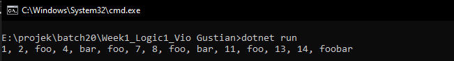
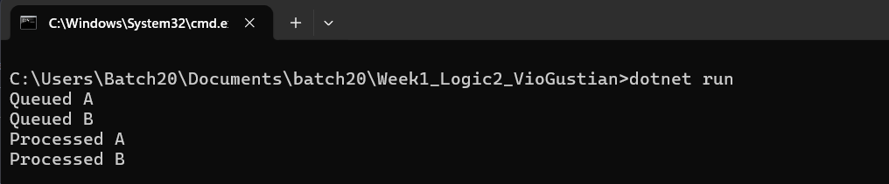

# Formulatrix SE Backend Bootcamp - Batch 20 

Welcome to my repository! This repository contains a collection of assignments and project submissions for the Software Engineer Backend Bootcamp - Batch 20 program at Formulatrix. All tasks are developed using C# (.NET).

---

## 📁 Task List

### 1. Week 1 - Logic 1: FooBarr

**Description:**  
A console application that generates a sequence of outputs based on the following rules:
- Multiples of `3` print **"Foo"**.
- Multiples of `5` print **"Bar"**.
- Multiples of both `3` and `5` print **"FooBar"**.

**Output:**  

### 2. Week 1 - Logic 2: Queue Logic

**Description:**  
A console application implementing a First-In-First-Out (FIFO) queue system that processes operations using direct method calls. The program is built with Separation of Concerns (SoC) and handles the following specific requirements:
- `Enqueue(val)`: Adds `[val]` to the back of the queue and outputs **"Queued [val]"**.
- `Process()`: Removes the front value of the queue and outputs **"Processed [val]"**.
- **Edge Case Handling**: Outputs **"Queue is empty"** if `Process()` is called but there is no value left in the queue.

**Output:**  

