# Formulatrix SE Backend Bootcamp - Batch 20 

Welcome to my repository! This repository contains a collection of assignments and project submissions for the Software Engineer Backend Bootcamp - Batch 20 program at Formulatrix. All tasks are developed using C# (.NET).

---

## 📁 Task List

### 1. Week 1 - Logic 1: FooBarr

**Description:**  
A console application that generates a sequence of outputs based on the following rules:
- Multiples of `3` print **"Foo"**.
- Multiples of `5` print **"Bar"**.
- Multiples of both `3` and `5` print **"FooBar"**.

**Output:**  
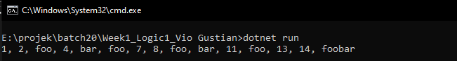

### 2. Week 1 - Logic 2: Queue Logic

**Description:**  
A console application implementing a First-In-First-Out (FIFO) queue system that processes operations using direct method calls. The program is built with Separation of Concerns (SoC) and handles the following specific requirements:
- `Enqueue(val)`: Adds `[val]` to the back of the queue and outputs **"Queued [val]"**.
- `Process()`: Removes the front value of the queue and outputs **"Processed [val]"**.
- **Edge Case Handling**: Outputs **"Queue is empty"** if `Process()` is called but there is no value left in the queue.

**Output:**  
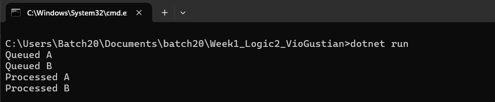

### 3. Week 1 - Logic 3: Stack Logic

**Description:**  
A console application implementing a Last-In-First-Out (LIFO) stack system that processes operations using direct method calls. The program is built with Separation of Concerns (SoC) and handles the following specific requirements:
- `Type(word)`: Pushes `[word]` to the top of the stack and outputs **"Typed [word]"**.
- `Undo()`: Removes the top value of the stack and outputs **"Undid [word]"**.
- **Edge Case Handling**: Outputs **"Nothing to undo."** if `Undo()` is called but there is no value left in the stack.

**Output:**  
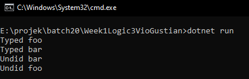

### 4. Week 1 - Logic 4: Sequence Logic

**Description:** 
A console application that manages a sequence of integers using a custom Node structure (Head & Tail Linked List). The program processes operations using direct method calls and handles the following specific requirements:
- `Append(val)`: Adds a new node containing `[val]` to the tail of the sequence and outputs **"Appended [val]"**.
- `Print()`: Traverses the connected nodes from head to tail and outputs the sequence in the format **"Sequence: [val1] -> [val2]"**.

**Output:** 
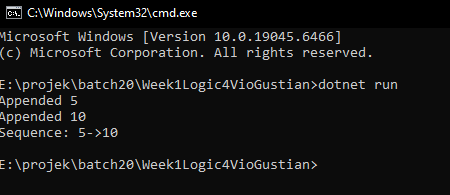

### 5. Week 1 - Logic 5: Circular Queue Logic

**Description:**  
A console application implementing a fixed-size Circular Queue (ring buffer) that processes operations using direct method calls. The program is built with Separation of Concerns (SoC) and handles the following specific requirements:
- `Log(val)`: Adds `[val]` to the buffer and outputs **"Logged [val]"**. If the buffer has reached its maximum capacity, outputs **"Buffer Full"** and rejects the value instead.
- `Read()`: Removes and outputs the oldest unread value in the format **"Read [val]"**.
- **Edge Case Handling**: Outputs **"Log is Empty."** if `Read()` is called but there is no value left in the buffer.

**Output:**  
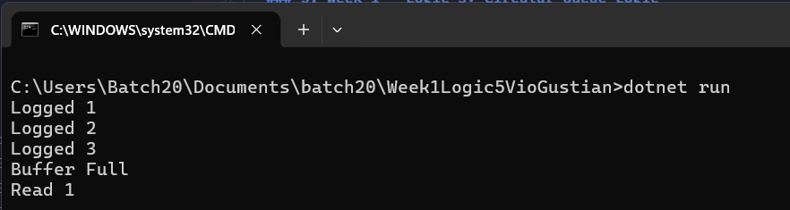

### 6. Week 2 - Logic 1: FooBarJazz

**Description:**  
A console application that extends the Week 1 FooBar logic with a third rule based on divisibility by `7`. Unlike the original if-else-if approach, matching rules now concatenate instead of being mutually exclusive:
- Multiples of `3` print **"foo"**.
- Multiples of `5` print **"bar"**.
- Multiples of `7` print **"jazz"**.
- Numbers matching multiple rules print the combined output (e.g. `21` → **"foojazz"**, `35` → **"barjazz"**, `105` → **"foobarjazz"**).

**Output:**  
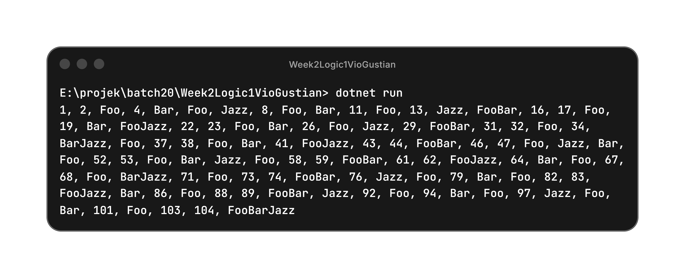

### 7. Week 2 - Logic 2: Queue VIP Logic

**Description:**  
A console application implementing a First-In-First-Out (FIFO) queue system that includes a priority line. The program is built with Separation of Concerns (SoC) and handles the following specific requirements:
- `Enqueue(val)`: Adds `[val]` to the back of the queue and outputs **"Queued [val]"**.
- `EnqueueVip(val)`: Adds `[val]` to the absolute front of the queue instead of the back and outputs **"VIP Queued [val]"**.
- `Process()`: Removes the front value of the queue and outputs **"Processed [val]"**.
- **Edge Case Handling**: Outputs **"Queue is empty"** if `Process()` is called but there is no value left in the queue.

**Output:**  
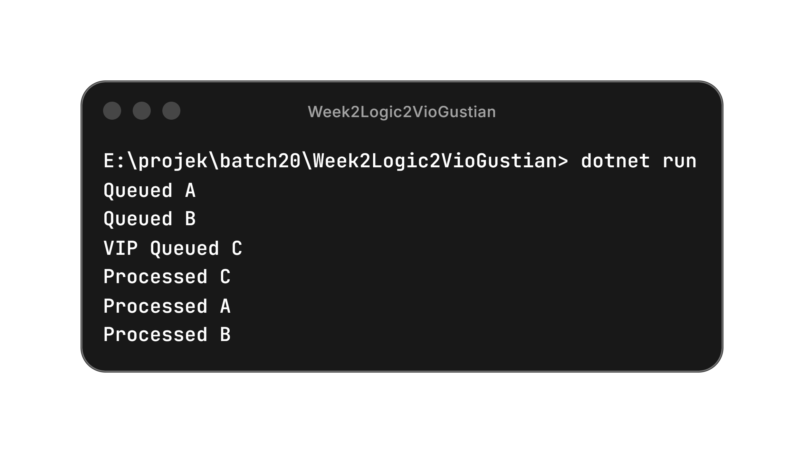

### 8. Week 2 - Logic 3: Stack Logic Limit

**Description:**
A console application that extends the Week 1 Stack Logic with a maximum history limit of `3` items. The program maintains a Last-In-First-Out (LIFO) stack system using direct method calls and handles the following specific requirements:

* `Type(word)`: Pushes `[word]` to the top of the stack and outputs **"Typed [word]"**.
* **Maximum History Limit**: The stack can set a maximum items.
* **History Overflow**: If `Type(word)` is called when the stack already contains maximum items limit, the oldest item at the absolute bottom of the stack is removed to make room for the new item. The program outputs **"Dropped bottom, Typed [word]"**.
* `Undo()`: Removes the top value of the stack and outputs **"Undid [word]"**.
* **Edge Case Handling**: Outputs **"Nothing to undo."** if `Undo()` is called but there is no value left in the stack.

**Output:**  
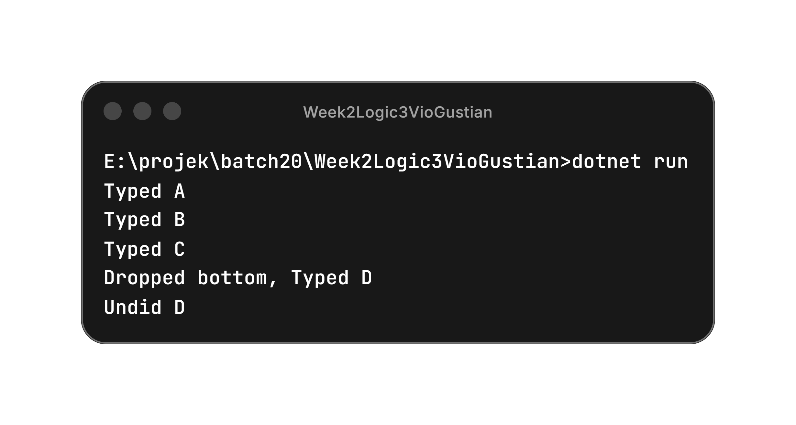

### 9. Week 2 - Logic 4: Doubly Linked List Sequence Logic 
 
**Description:**   
A console application that upgrades the Week 1 Sequence Logic into a Doubly Linked List using a custom `Node` structure with `Next` and `Previous` references. The program processes operations using direct method calls and handles the following specific requirements: 
- `Append(val)`: Adds a new node containing `[val]` to the tail of the sequence and outputs **"Appended [val]"**. 
- `Print()`: Traverses the connected nodes from head to tail using the `Next` reference and outputs the sequence in the format **"Sequence: [val1] -> [val2]"**. 
- `PrintReverse()`: Traverses the connected nodes from tail to head using the `Previous` reference and outputs the reversed sequence in the format **"Reversed: [val2] -> [val1]"**. 
 
**Output:**   
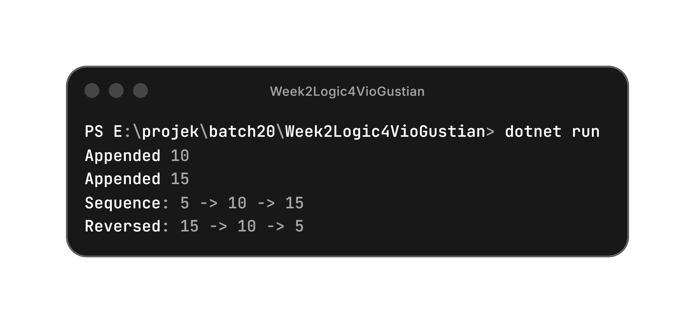

### 10. Week 2 - Logic 5: Circular Queue Overwrite Logic

**Description:** 
A console application that extends the Week 1 Circular Queue logic. Instead of rejecting new items when the fixed-size ring buffer is full, the program now dynamically overwrites the oldest data. Built with Separation of Concerns (SoC), it handles the following specific requirements:
- `Log(val)`: Adds `[val]` to the buffer. If the buffer is not full, it outputs **"Logged [val]"**.
- **Capacity Overflow**: If `Log(val)` is called when the buffer has reached its maximum capacity, the oldest unread log is dropped and replaced by `[val]`. The program outputs **"Overwritten oldest with [val]"**.
- `Read()`: Removes and outputs the oldest unread value in the format **"Read [val]"**.
- **Edge Case Handling**: Outputs **"Log is Empty."** if `Read()` is called but there is no value left in the buffer.

**Output:** 
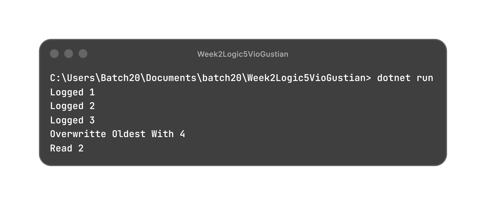

### 11. Week 3 - Logic 1: FooBarJazz

**Description:**   
A console application that extends the Week 2 FooBarJazz logic with additional divisor-to-text rules. Matching rules are evaluated in ascending divisor order and concatenated when a number is divisible by multiple factors: 
- Multiples of `3` print **"foo"**. 
- Multiples of `4` print **"baz"**. 
- Multiples of `5` print **"bar"**. 
- Multiples of `7` print **"jazz"**. 
- Multiples of `9` print **"huzz"**. 
- Numbers matching multiple rules print the combined output following the ascending divisor order. For example, `36` is divisible by `3`, `4`, and `9`, so it prints **"foobazhuzz"**. 
 
**Output:**   

### 12. Week 3 - Logic 2: Priority Queue Logic

**Description:**  
A console application that replaces the VIP queue rule from Week 2 with an integer-based priority queue system. The queue processes items based on their priority while maintaining FIFO order when multiple items have the same priority:
- `Enqueue(val, p)`: Adds `[val]` to the queue with priority `[p]` and outputs **"Queued [val] with priority [p]"**.
- `Process()`: Finds and removes the value with the highest priority and outputs **"Processed [val]"**.
- **FIFO Tiebreak**: If multiple values have the same highest priority, the oldest value is processed first.
- **Edge Case Handling**: Outputs **"Queue is Empty"** if `Process()` is called but there is no value left in the queue.

**Output:**  
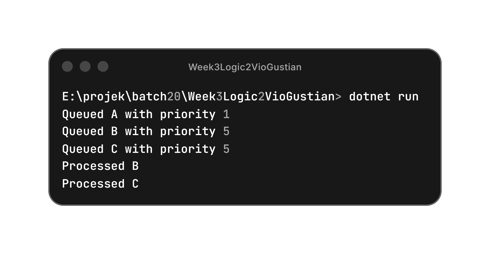

### 13. Week 3 - Logic 3: Stack Logic Undo & Redo

**Description:**
A console application that extends the Week 2 Stack Logic Limit by introducing a `Redo` functionality. The program manages both the main stack and a redo history, handling the following specific requirements:
- `Type(word)`: Pushes `[word]` to the top of the stack, **clears the redo history** (as the timeline has changed), and outputs **"Typed [word]"**. If the stack reaches its maximum history limit, the oldest item at the bottom is dropped, outputting **"Dropped bottom, Typed [word]"**.
- `Undo()`: Removes the top value of the stack, saves it to the redo history, and outputs **"Undid [word]"**.
- `Redo()`: Restores the most recently undone value from the redo history back to the main stack and outputs **"Redid [word]"**.
- **Edge Case Handling**: Outputs **"Nothing to undo."** if `Undo()` is called when the stack is empty, and **"Nothing to redo."** if `Redo()` is called when the redo history is empty.

**Output:**  
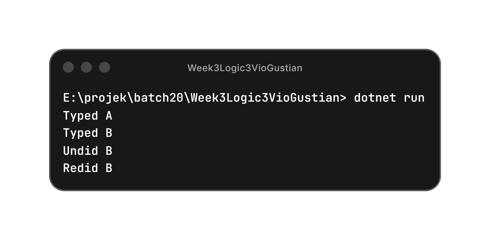

### 14. Week 3 - Logic 4: Sorted Doubly Linked List Logic

**Description:** 
A console application that upgrades the Week 2 Doubly Linked List logic. Instead of merely appending new nodes to the tail, the system now automatically traverses the list and inserts new values in **ascending order**. The program processes operations using direct method calls and handles the following specific requirements:
- `Insert(val)`: Finds the correct sorted position for `[val]` within the doubly linked list, updates the surrounding `Next` and `Previous` references, and outputs **"Inserted [val]"**.
- `Print()`: Traverses the connected nodes from head to tail using the `Next` reference and outputs the sorted sequence in the format **"Sequence: [val1] -> [val2]"**.
- `PrintReverse()`: Traverses the connected nodes from tail to head using the `Previous` reference and outputs the reversed (descending) sequence in the format **"Reversed: [val2] -> [val1]"**.

**Output:** 
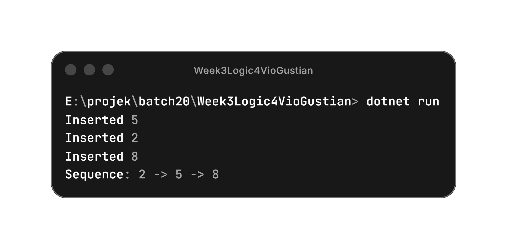

### 15. Week 3 - Logic 5: Circular Queue Alert Logic

**Description:**  
A console application that extends the Week 2 Circular Queue Overwrite logic by introducing dynamic capacity alerts. Before each `Log(val)` operation is executed, the program evaluates the current buffer utilization and raises warnings accordingly:
- `Log(val)`: Adds `[val]` to the buffer. If the buffer is not full, it outputs **"Logged [val]"**.
- **Capacity Overflow**: If `Log(val)` is called when the buffer has reached its maximum capacity, the oldest unread log is dropped and replaced by `[val]`. The program outputs **"Overwritten oldest with [val]"**.
- **Warning Alert**: Before logging, if the current unread logs utilize **66% or more** of the buffer's capacity, the program outputs **"Warning: Buffer at 66%"**.
- **Critical Alert**: Before logging, if the current unread logs utilize **100%** of the buffer's capacity, the program outputs **"Critical: Buffer Full"** instead of the warning.
- `Read()`: Removes and outputs the oldest unread value in the format **"Read [val]"**.
- **Edge Case Handling**: Outputs **"Log is Empty."** if `Read()` is called but there is no value left in the buffer.

**Output:**  
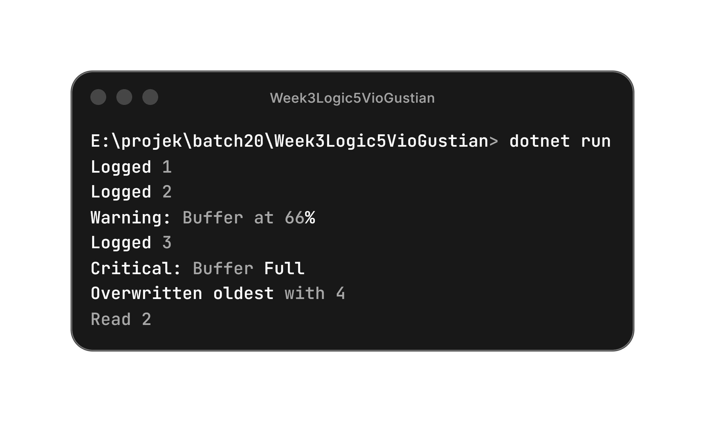

### 16. Week 3 - Logic 6: Rule-Based Generator

**Description:** 
A console application that refactors the FooBazHuzz logic into an object-oriented, client-configurable rule engine. By utilizing a `SortedDictionary`, the program allows users to dynamically register divisor-to-text rules at runtime, guaranteeing they are evaluated in ascending divisor order for deterministic output. The class handles the following specific requirements:
- `AddRule(divisor, output)`: Registers a new divisor-to-text mapping at runtime.
- `Evaluate(number)`: Evaluates a single number against all registered rules, concatenating outputs when multiple rules match (e.g., if rules for 3="foo" and 4="baz" exist, 12 prints **"foobaz"**).
- `GenerateSequence(start, end)`: Generates and returns a comma-separated sequence over a specified range based on the configured rules.

**Output:** 
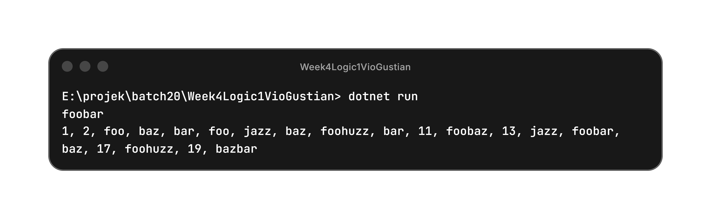

### 17. Week 4 - Logic 2: Keyword-Based Priority Queue

**Description:** 
A console application that refactors the Priority Queue logic by introducing an automated, client-configurable keyword system. Instead of manually providing a priority integer for every item, the queue evaluates incoming data and assigns priority dynamically based on pre-registered rules. The class handles the following specific requirements:
- `AddRule(keyword, priority)`: Registers a string keyword-to-priority mapping at runtime.
- `Enqueue(val)`: Adds `[val]` to the queue. The program scans the value for matching keywords. If found, the mapped priority is assigned automatically. If no rule matches, a default priority of `0` is assigned. Outputs **"Queued [val] with priority [p]"**.
- `Process()`: Removes the value with the highest priority and outputs **"Processed [val]"**, while still maintaining a strict FIFO tiebreak order when multiple items share the highest priority.

**Output:** 
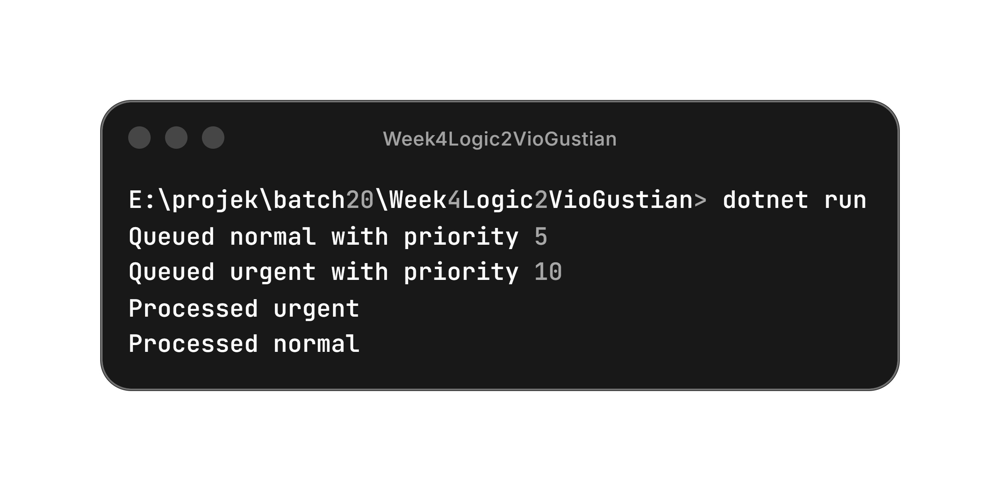

### 18. Week 4 - Logic 3: Configurable Validation Stack Logic

**Description:** 
A console application that refactors the Stack Logic Undo & Redo into an object-oriented, client-configurable validation engine. The program allows users to dynamically register predicate rules (`Func<string, bool>`) that strictly evaluate incoming data before it is allowed into the history stack. The class handles the following specific requirements:
- `AddValidationRule(rule)`: Registers a new boolean predicate rule at runtime. All registered rules must pass (logical AND) for an input to be successfully accepted.
- `Type(word)`: Evaluates the input against all validation rules. If it passes, the word is added to the stack, the redo history is cleared, and it outputs **"Typed [word]"**. If validation fails, the word is denied and it outputs **"Rejected [word]"** (or just **"Rejected"** for empty inputs).
- **History Overflow**: Maintains the maximum history limit. If the stack is full upon a successful type operation, the oldest item at the bottom is dropped, outputting **"Dropped bottom, Typed [word]"**.
- `Undo()` and `Redo()`: Preserves the previous LIFO history traversal mechanics, safely outputting **"Nothing to undo."** or **"Nothing to redo."** if boundaries are reached.

**Output:** 
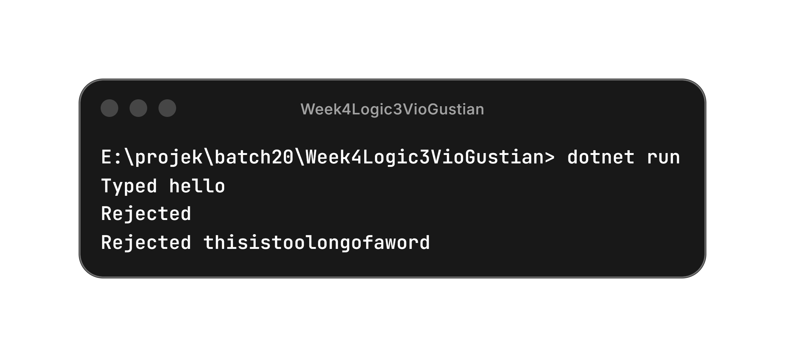

### 19. Week 4 - Logic 4: Configurable Sorting & Filtering Sequence Logic

**Description:** 
A console application that refactors the Week 3 Sorted Doubly Linked List. Instead of sorting nodes permanently upon insertion, the program reverts to a simple append mechanism and introduces a client-configurable sorting and filtering engine. The evaluation is done on-the-fly during output without altering the underlying Doubly Linked List structure. The class handles the following specific requirements:
- `SetSorting(comparer)`: Configures a custom sorting comparator (`Func<int, int, int>`) that defines how the sequence should be ordered during output.
- `AddFilter(filterRule)`: Registers a boolean predicate rule (`Func<int, bool>`). Multiple filters can be added, and all must pass (logical AND) for a node's value to be displayed.
- `Append(val)`: Reverts to a standard $O(1)$ insertion by adding a new node containing `[val]` to the tail of the sequence and outputs **"Appended [val]"**.
- `Print()` and `PrintReverse()`: Traverses the doubly linked list. Before displaying, it dynamically applies all configured filter rules and the custom sorting logic to output the result in the format **"Sequence: [val1] -> [val2]"** or **"Reversed: [val2] -> [val1]"**.

**Output:** 
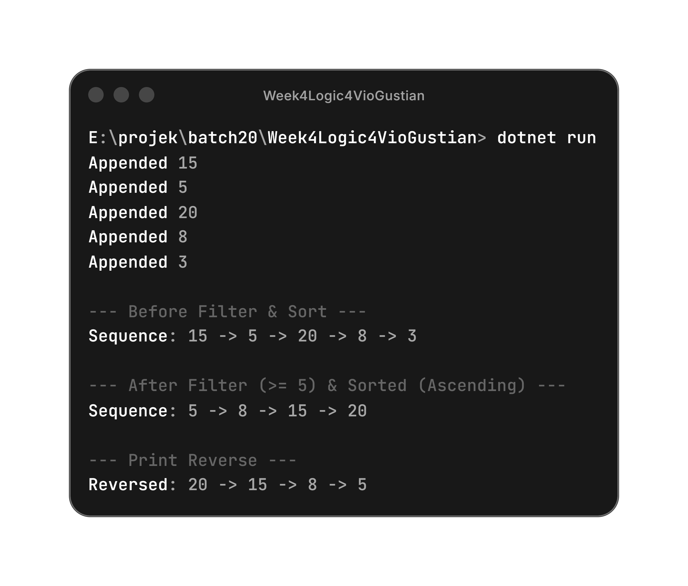

### 20. Week 4 - Logic 5: Configurable Circular Queue Logic

**Description:**
A console application that refactors the Week 3 Circular Queue Alert logic into a fully client-configurable buffer. Instead of fixed capacity and a hardcoded overwrite behavior, the class now exposes runtime configuration methods while preserving the existing alert mechanics. It handles the following specific requirements:
- `SetCapacity(n)`: Sets the buffer's maximum capacity to `[n]` and resets any existing data in the buffer.
- `SetOverwritePolicy(isOverwriteEnabled)`: Configures the buffer's behavior when full. If `true`, a full buffer overwrites the oldest unread log. If `false`, a full buffer rejects new entries instead.
- `Log(val)`: Adds `[val]` to the buffer. If the buffer is not full, it outputs **"Logged [val]"**.
- **Capacity Overflow (Overwrite Enabled)**: If `Log(val)` is called when the buffer is full and overwrite is enabled, the oldest unread log is dropped and replaced by `[val]`, outputting **"Overwritten oldest with [val]"**.
- **Capacity Overflow (Overwrite Disabled)**: If `Log(val)` is called when the buffer is full and overwrite is disabled, the new value is rejected instead.
- **Warning Alert**: Before logging, if the current unread logs utilize **66% or more** of the buffer's capacity, the program outputs **"Warning: Buffer at 66%"**.
- **Critical Alert**: Before logging, if the current unread logs utilize **100%** of the buffer's capacity, the program outputs **"Critical: Buffer Full"** instead of the warning.
- `Read()`: Removes and outputs the oldest unread value in the format **"Read [val]"**.
- **Edge Case Handling**: Outputs **"Log is Empty."** if `Read()` is called but there is no value left in the buffer.

**Output:**
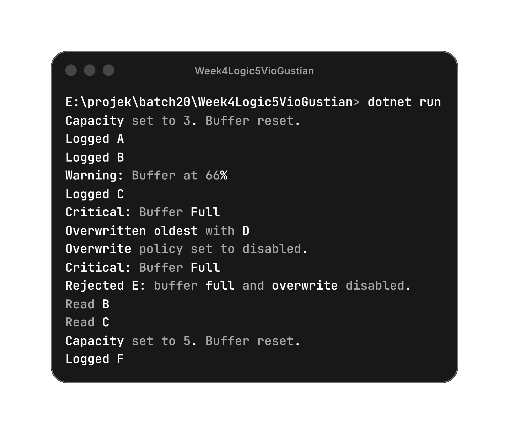